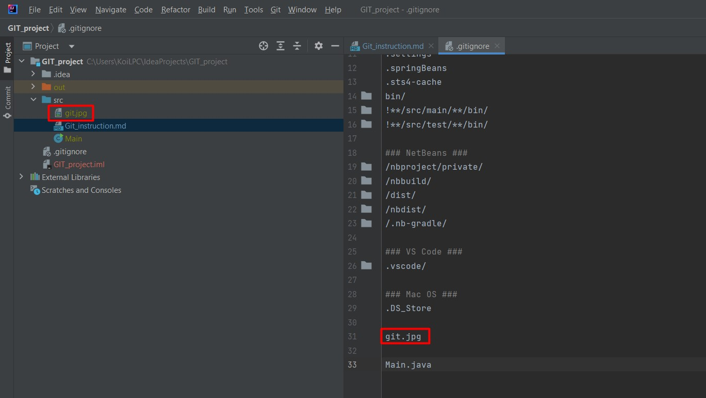
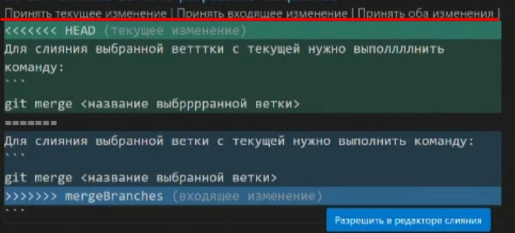
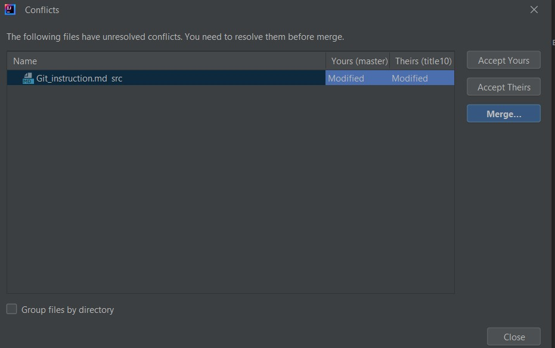
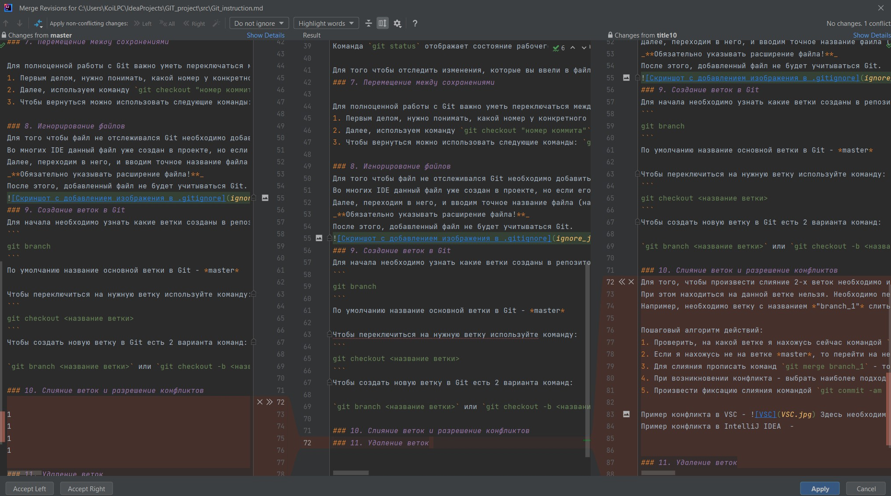
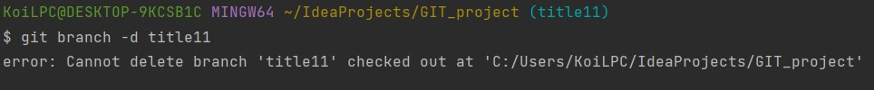
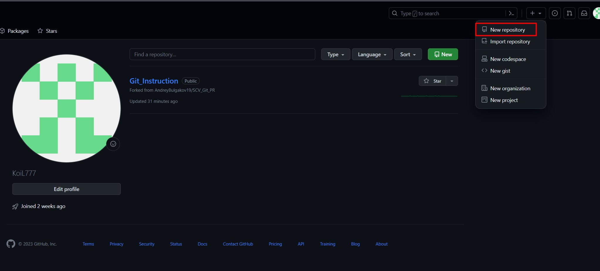
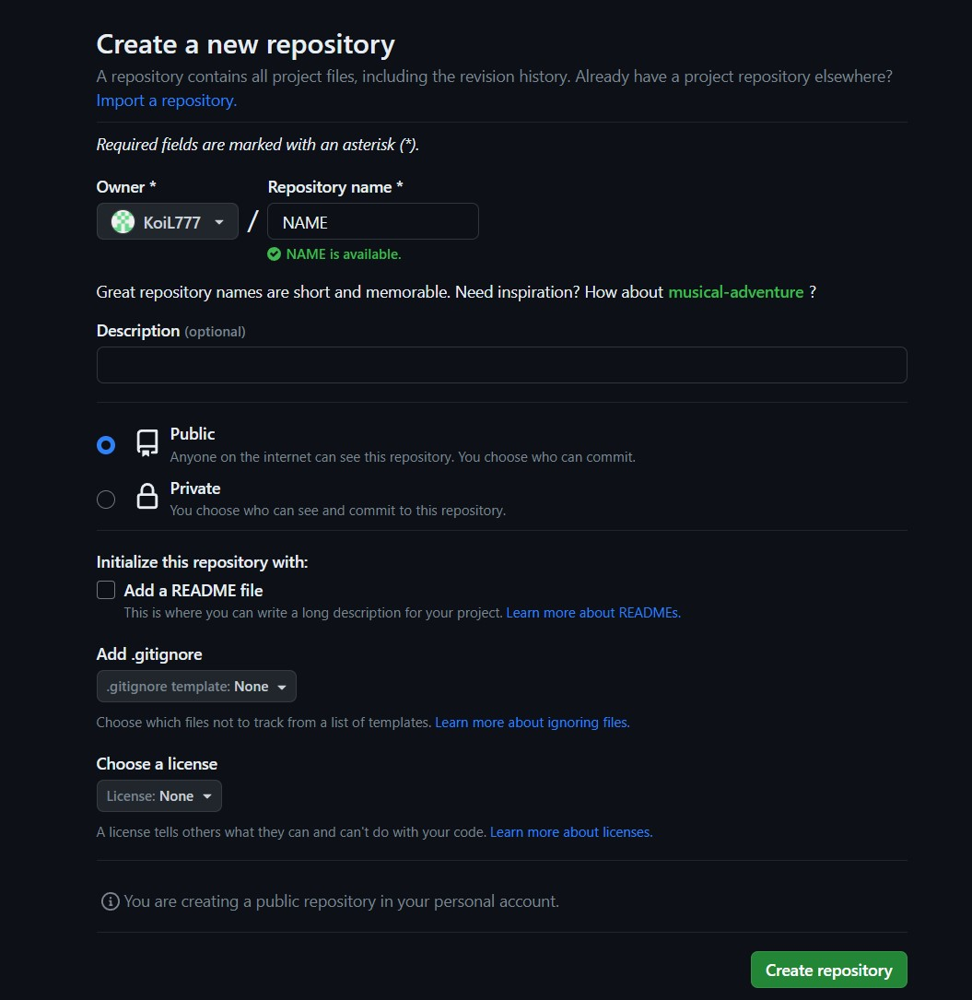
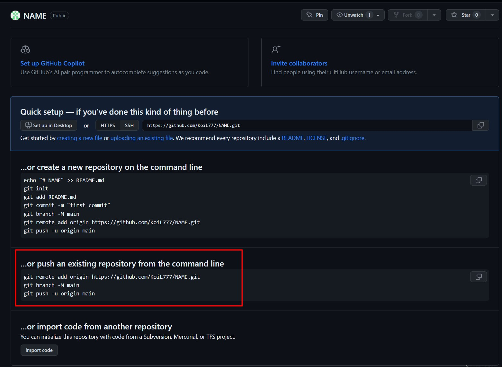
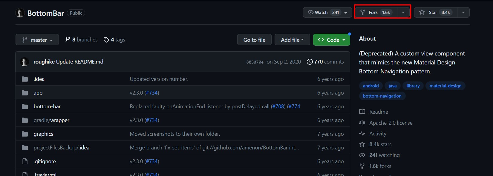

# **Работа с Git и GitHub**
## Что такое Git
GIT — это самая популярная распределенная система управления версиями. GIT широко применяется для разработки как программного обеспечения (ПО) с открытым кодом, так и коммерческого ПО, предоставляя важные преимущества отдельным разработчикам, командам и компаниям. GIT позволяет разработчикам просматривать всю временную шкалу изменений, решений и хода выполнения любого проекта в одном месте.
## Подробная инструкция по работе с Git
### 1. Проверка наличия установленного Git
В терминале (или в командной строке) выполнить команду `git version`.
Если Git установлен, то появится сообщение с информацией о версии программы, иначе будет сообщение об ошибке.
### 2. Установка Git
Если Git не установлен на компьютер, то необходимо сделать его установить.
Загружаем последнюю версию Git с сайта https://git-scm.com/downloads .
Устанавливаем с настройками по умолчанию.
### 3. Настройка Git
При первом использовании Git необходимо представиться. Для этого необходимо в терминале выполнить 2 команды:
```
git config --global user.name "Your name"
git config --global user.email Youremail@example.com
```
* *Желательно указывать реальную почту*

### 4. Инициализация репозитория

После того как Git установлен на компьютер необходимо выполнить его инициализацию. Для этого в терминале необходимо ввести команду:

`git init`
Данная команда создаст репозиторий (скрытую папку .git)
### 5. Запись изменений в репозиторий
Далее, необходимо разобраться каким образом вносить изменения в репозиторий и сохранять их.
Разберем на примере файла простого текстового файла.

1. Вы создали файл с необходимым расширением внутри терминала (*например, .txt или .md*)
2. Начали заполнение созданного файла и Вам необходимо сохранить текущий вариант файла
3. В терминале (*лучше использовать терминал Git Bash*) необходимо выполнить команду `git add "имя файла"`. Данная команда подготовит текущий файл для создания будущего коммита.
4. Затем, чтобы создать commit, необходимо ввести команду `git commit -m "название заголовка для коммита"`. Данная команда создаст коммит текущей версии файла с заданным Вами названием.
5. Также, существуют команды `git commit -a -m "название сохранения"`, которая позволяет пропустить шаг `git add`, но у нее есть особенности: во-первых, она работает сразу на все файлы в репозитории, во-вторых, она не позволяет создавать новый файл, а лишь позволяет вносить изменения в существующие.
### 6. Просмотр истории коммитов
Для того чтобы просмотреть всю историю созданных Вами коммитов, нужно ввести команду `git log`. Данная команда покажет всю историю с подробными данными, включая автора, дату, полный идентификатор коммита. Чтобы посмотреть всю историю коммитов в кратком виде по названиям, нужно ввести команду `git log --oneline`
Также, возможно увидеть историю изменений с визуализированным деревом веток при помощи команды `git log --graph`

Команда `git status` отображает состояние рабочего каталога и раздела проиндексированных файлов. С ее помощью можно проверить индексацию изменений и увидеть файлы, которые не отслеживаются Git.

Для того чтобы отследить изменения, которые вы ввели в файл, но не занесли в коммит, существует команда `git diff`
### 7. Перемещение между сохранениями

Для полноценной работы с Git важно уметь переключаться между созданными коммитами.
1. Первым делом, нужно понимать, какой номер у конкретного коммита, чтобы на него можно было переключиться. Для этого вводим уже знакомую команду `git log` и копируем первые 7 символов интересующего коммита.
2. Далее, используем команду `git checkout "номер коммита"`. После ввода данной команды файл полностью вернется к сохраненной версии файла.
3. Чтобы вернуться можно использовать следующие команды: `git checkout master` или `git switch -`. Рекомендуется пользоваться именно второй командой.

### 8. Игнорирование файлов
Для того чтобы файл не отслеживался Git необходимо добавить его в специальный файл под названием `.gitignore`
Во многих IDE данный файл уже создан в проекте, но если его нет, то необходимо его создать внутри папки с проектом.
Далее, переходим в него, и вводим точное название файла (например, изображения).
_**Обязательно указывать расширение файла!**_
После этого, добавленный файл не будет учитываться Git.


Для удобства, в файле gitignore можно прописать `*.jpg`, тогда все файлы расширения *jpg* буду автоматически игнорироваться Git.
### 9. Создание веток в Git
Для начала необходимо узнать какие ветки созданы в репозитории. Для этого существует команда:
```
git branch
```
По умолчанию название основной ветки в Git - *master*

Чтобы переключиться на нужную ветку, используйте команду:
```
git checkout <название ветки>
```
Чтобы создать новую ветку в Git есть 2 варианта команд:

`git branch <название ветки>` или `git checkout -b <название ветки>`. При использовании второго варианта вы сразу перемещаетесь на созданную ветку.

### 10. Слияние веток и разрешение конфликтов
Для того, чтобы произвести слияние 2-х веток необходимо использовать команду `git merge <название ветки которую нужно слить>`
При этом находиться на данной ветке нельзя. Необходимо перейти на ветку, в которую будет происходить слияние и уже после этого использовать команду.
Например, необходимо ветку с названием *"branch_1"* слить с веткой *"master"*. 

Пошаговый алгоритм действий:
1. Проверить, на какой ветке я нахожусь сейчас командой `git branch`
2. Если я нахожусь не на ветке *master*, то перейти на неё командой `git switch master` или `git checkout master`
3. Для слияния прописать команд `git merge branch_1` - то есть ветку *branch_1* слить с веткой *master* (в которой я нахожусь сейчас)
4. При возникновении конфликта - выбрать наиболее подходящий вариант редактирования текста при слиянии (в разных редакторах по-разному, например в VSC появляются кнопки в редакторе текста, а в IntelliJ IDEA необходимо заходить внутрь редактора конфликтов и принимать решение в нем)
5. Произвести фиксацию слияния командой `git commit -am "<название заголовка коммита>` 

Пример конфликта в VSC - Здесь необходимо нажать на необходимую кнопку и подтвердить изменения
Пример конфликта в IntelliJ IDEA - Здесь необходимо сначала зайти внутрь редактора конфликтов, а далее выбрать необходимый вариант.


### 11. Удаление веток
Для того чтобы удалить ветку в Git необходимо воспользоваться командой:
```
git branch -d <название ветки>
```
Однако существует ряд условий: 
1. Вы не должны находится на ветке, которую пытаетесь удалить, иначе возникнет следующая ошибка: 
2. Если ветка не полностью слита с основной веткой, то данной командой удаление сделать не получится. Для этого можно использовать принудительную команду:
```
git branch -D <название ветки>
```
## Работа с удаленными репозиториями

### Регистрация в GitHub
Первым делом, необходимо пройти регистрацию в GitHub по ссылке https://github.com/join

*Важно не путать GitHub и Git. Это две разные вещи: GitHub - сервис для работы с удаленными репозиториями от компании Microsoft, а Git - это программа для контроля версионности.*

### Создание удаленного репозитория

Для работы на GitHub есть возможность копировать сторонние удаленные репозитории себе, создавать новые.
Чтобы создать новый удаленный репозиторий, необходимо нажать на кнопку "+" в правом верхнем углу и выбрать параметр "New repository"


Далее, назначаем ему имя, описание, параметр публичности (public или private) и другие:


После этого, GitHub сам предложит варианты действий, в зависимости от ситуации. Например, чтобы добавить существующий локальный репозиторий в только что созданный удаленный репозиторий необходимо ввести следующие команды, предлагаемые GitHub


`git remote add origin https://github.com/KoiL777/NAME.git` - подключается к удаленному репозиторию и дает ему имя <origin>

`git branch -M main` - переименовывает ветку на который находится пользователь в локальном репозитории на <main>

`git push -u origin main` - отправляет изменения в GitHub 

**Важно: при первом подключении необходима авторизация в браузере на GitHub. Пройти ее не составляет труда, последовательно выполняя рекомендации от GitHub и нажимая необходимые кнопки в браузере.**

Также, разберем клонирование чужого репозитория на свой ПК. 
Для этого в поиске нужно найти интересующий репозиторий другого пользователя. Далее перейти на него и нажать на кнопку <Fork>


После этого GitHub создаст копию данного репозитория с отсылкой на автора. Чтобы загрузить его к себе локально на ПК, необходимо нажать на зеленую кнопку "Code"
и скопировать url-адрес HTTPS.
Затем, внутри терминала ввести команду:

 `git clone <скопированная ссылка>`  - Git загрузит весь репозиторий локально на компьютер в папку, где находится пользователь.

### Работа с удаленным репозиторием

После того как чужой репозиторий скопирован локально на компьютер мы можем производить изменения. Делать это рекомендовано в новой ветке.

Далее, после внесения изменений при помощи команды `git push` - мы можем их отправить на удаленный репозиторий GitHub.

А если изменения вносились на удаленном репозитории, и нам нужна последняя актуальная версия на ПК, то существует команда `git pull`.

Она позволяет загрузить все последние изменения и одновременно с этим производит слияние (что может вызвать конфликт, но он решается точно так же, как это описано в пункте 10)

### Pull requests в GitHub

GitHub позволяет предлагать изменения, которые мы произвели автору скопированного репозитория. 
Для этого кратко повторим алгоритм действий:
1. В своём аккаунте на GitHub создать копию необходимого репозитория с помощью кнопки **"Fork"**.
2. Клонировать копию репозитория на локальный компьютер с помощью команды `git clone <ссылка>`
3. Создать новую ветку с помощью команды `git branch <name>`
4. Внести необходимые изменения
5. Зафиксировать изменения (коммиты).
6. Отправить изменения на GitHub с помощью команды `git push`
7. На сайте GitHub выполнить **Pull request**.

Pull request выполняется с помощью соответствующей кнопки внутри скопированного репозитория, но если кнопка не появилась, это можно сделать вручную через раздел на GitHub с названием **Pull requests**

Далее нажимаем на кнопку **New pull requests**, выбираем нужную ветку, даем название, комментарий и отправляем автору на проверку.